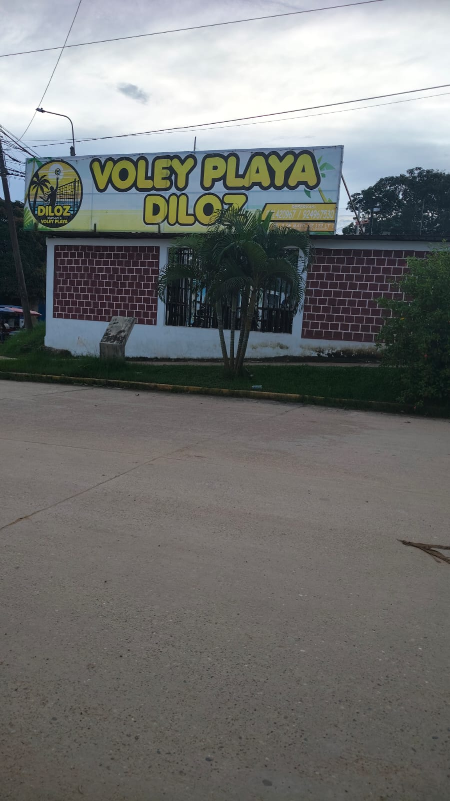

# 🏐 VOLEY PLAYA DILOZ - Sistema de Gestión de Reservas

Este proyecto es una solución web diseñada para digitalizar y optimizar la administración del alquiler de canchas de vóley playa, reemplazando los métodos de registro manuales por una plataforma eficiente, segura y organizada.

## 📖 1. Descripción del Negocio
**VOLEY PLAYA DILOZ** se dedica a brindar espacios deportivos para la práctica de vóley playa. Ante el crecimiento de la demanda, el negocio busca profesionalizar su gestión para ofrecer una mejor experiencia al cliente y un control total sobre sus operaciones diarias.

## ⚠️ 2. El Problema y la Solución
### El Problema
Actualmente, la gestión se realiza en cuadernos físicos, lo que provoca:
*   **Desorden:** Errores en el registro de fechas y duplicidad de reservas.
*   **Invisibilidad de datos:** Dificultad para conocer la disponibilidad en tiempo real.
*   **Falta de control:** Complicaciones para rastrear pagos y pérdida de información de clientes.

### La Solución
Implementar un sistema web centralizado que automatice el flujo de reservas, valide la disponibilidad de canchas instantáneamente y mantenga un historial preciso de clientes y transacciones financieras.

## 🛠️ 3. Preanálisis Técnico
*   **Tecnologías:** PHP (Backend), MySQL (Base de datos), Bootstrap 5 (Frontend) y XAMPP (Servidor local).
*   **Viabilidad:** Bajo costo de implementación y alta eficiencia en el procesamiento de datos.
*   **Alcance:** El sistema permite la gestión completa del ciclo de vida de una reserva (crear, modificar, cancelar) y el registro de pagos, sin incluir pasarelas de pago en línea en esta fase inicial.

## 📊 4. Análisis de Requerimientos
### Requisitos Funcionales
- [x] **Autenticación:** Inicio de sesión seguro para el administrador.
- [x] **Gestión de Entidades:** CRUD de clientes, canchas y reservas.
- [x] **Lógica de Negocio:** Validación automática de disponibilidad para evitar cruces de horarios.
- [x] **Control Financiero:** Registro y seguimiento de estados de pago.

### Requisitos No Funcionales
- **Seguridad:** Protección de rutas y validación de datos del lado del servidor.
- **Interfaz (UI):** Diseño responsivo y amigable basado en Bootstrap 5.
- **Rendimiento:** Consultas optimizadas para una respuesta inmediata.

## 🏗️ 5. Arquitectura del Proyecto
El sistema sigue una estructura profesional de carpetas para garantizar que sea mantenible y escalable, aplicando los conceptos de **Arquitectura Multicapa**:
*   `/models`: Gestión de la lógica de datos.
*   `/controllers`: Procesamiento de peticiones HTTP.
*   `/views`: Interfaces dinámicas con componentes modales.
*   `/config`: Configuraciones de conexión y variables globales.

## 📸 6. Evidencias del Proyecto
### Situación Actual (Problema)

### Interfaz del Sistema (Solución)
*(Aquí puedes insertar capturas de pantalla de tu Dashboard o de los Modales de registro que implementaste)*

